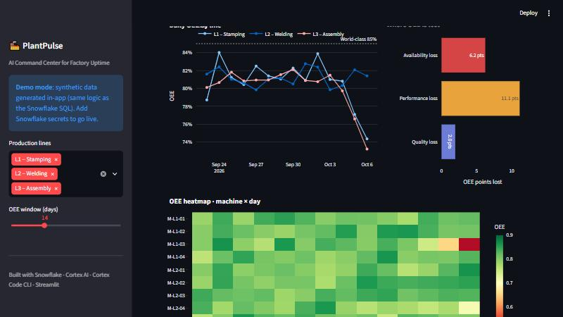
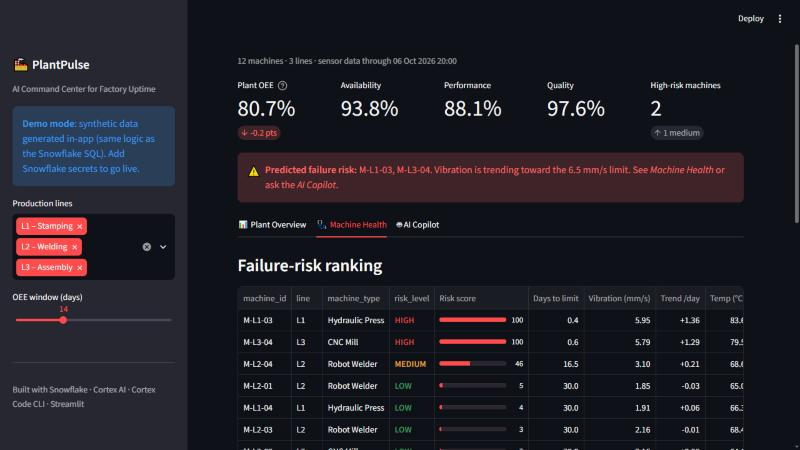
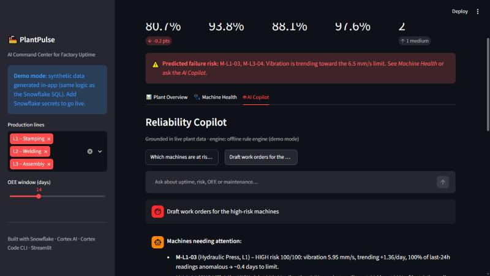

# 🏭 PlantPulse – AI Command Center for Factory Uptime

**Snowflake CoCo CLI Hackathon (GCC Edition) · Challenge: Predictive Maintenance and OEE Command Center**

PlantPulse turns raw machine telemetry and production logs in **Snowflake** into a single command center that:

1. **Measures** OEE (Availability × Performance × Quality) per machine, line and day.
2. **Detects** abnormal vibration/temperature with rolling z-scores in SQL (plus optional Snowflake ML `ANOMALY_DETECTION`).
3. **Predicts** failures: a 0–100 risk score and an estimate of the days left before vibration reaches the 6.5 mm/s alarm limit.
4. **Acts**: a Reliability Copilot built on **Snowflake Cortex `COMPLETE`** answers plain-English questions and drafts maintenance work orders using only the plant's data.

> **Live demo:** _see the deployed link in the submission_. With no Snowflake credentials, the app runs in **demo mode**: it generates the same synthetic data in-app with the same formulas as the SQL. Add Snowflake secrets and it switches to live Snowflake views and Cortex.



---

## The problem

Unplanned downtime typically costs manufacturers 5–20% of productive capacity. Maintenance teams react to failures instead of preventing them, and OEE data, sensor data and maintenance logs live in separate silos. Supervisors can't easily answer: *"Which machine will stop next, and what will it cost my OEE?"*

## The solution

| Layer | What it does | Snowflake feature |
|---|---|---|
| Data | Machines, hourly sensor readings, shift production, maintenance events | Tables, `GENERATOR`, SQL UDF |
| OEE | Daily A × P × Q per machine | View `OEE_DAILY` |
| Anomalies | z-score vs. a 7-day baseline that ends 24h before each reading | Window functions, view `SENSOR_SCORES` |
| Prediction | Risk score + days to the vibration limit (linear trend) | `REGR_SLOPE`, view `MACHINE_RISK` |
| ML (optional) | Unsupervised anomaly detection per machine | `SNOWFLAKE.ML.ANOMALY_DETECTION` |
| GenAI | Grounded copilot, work orders, shift-handover summary | `SNOWFLAKE.CORTEX.COMPLETE` |
| App | 3-page command center | Streamlit (+ `st.connection("snowflake")`) |

```
 SENSOR_READINGS ─┐                 ┌─> SENSOR_SCORES ──> MACHINE_RISK ─┐
 PRODUCTION_LOG ──┼─> Snowflake ────┼─> OEE_DAILY ──────────────────────┼─> Streamlit Command Center
 MACHINES ────────┤    (OPS schema) └─> VIB_DETECTOR (ML, optional)     │      ├─ Plant Overview
 MAINTENANCE ─────┘                                                     │      ├─ Machine Health
                                     Cortex COMPLETE <── grounded context      └─ AI Copilot
```

### The story in the data
- **M-L2-02** (Robot Welder) **failed 15 days ago**. Vibration and temperature rose for about 48h beforehand, which shows the signal predicts failures.
- **M-L1-03** and **M-L3-04** show the **same pattern right now**, so PlantPulse flags them **HIGH risk** with less than 1 day to the alarm limit and drafts P1 work orders.
- **M-L2-04** shows **early wear** and is flagged **MEDIUM** risk, with about 2 weeks of lead time to plan maintenance.

## Screenshots
| Machine health | AI Copilot |
|---|---|
|  |  |

---

## Run it

### 1. Snowflake (about 5 minutes)
Run the scripts in a Snowsight worksheet, or from the Cortex Code CLI / SnowSQL, in order:
```
sql/01_setup.sql          -- warehouse, database, tables
sql/02_synthetic_data.sql -- 12 machines x 30 days of telemetry + production
sql/03_views.sql          -- OEE_DAILY, SENSOR_SCORES, MACHINE_RISK
sql/04_cortex.sql         -- Cortex COMPLETE work orders + optional ML anomaly detection
```

### 2. App
```bash
pip install -r requirements.txt
streamlit run app/app.py
```
To use live Snowflake data, copy `.streamlit/secrets.toml.example` to `.streamlit/secrets.toml` and fill in your account details. On Streamlit Community Cloud, paste the same text into **App settings → Secrets**.

## Working with Cortex Code CLI
The project is laid out so the **Snowflake Cortex Code (CoCo) CLI** agent can deploy and extend it directly in your account:
```
cortex   # then e.g.:
> run sql/01_setup.sql through sql/04_cortex.sql in order and show me MACHINE_RISK
> add a view that estimates the downtime cost per machine and surface it in app/app.py
```

## Repo layout
```
app/app.py               Streamlit command center (Snowflake or demo mode)
app/plantpulse_core.py   Demo data + pandas mirror of the SQL analytics + copilot helpers
sql/01..04_*.sql         Snowflake setup, data, views, Cortex AI
docs/screenshots/        UI screenshots
```

## Roadmap
- Stream real PLC/IoT data via Snowpipe Streaming; schedule the risk scoring with Tasks
- Cortex Analyst semantic model for free-form SQL Q&A over OEE
- Push work orders to SAP PM / Maximo; Slack alerts for HIGH-risk machines
- Estimate the cost of downtime per machine to rank maintenance by money saved
